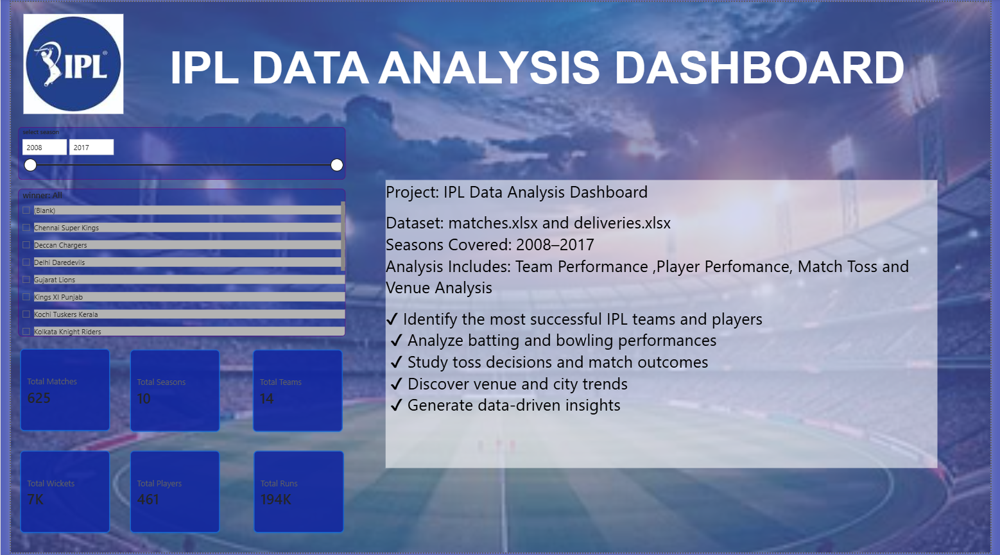
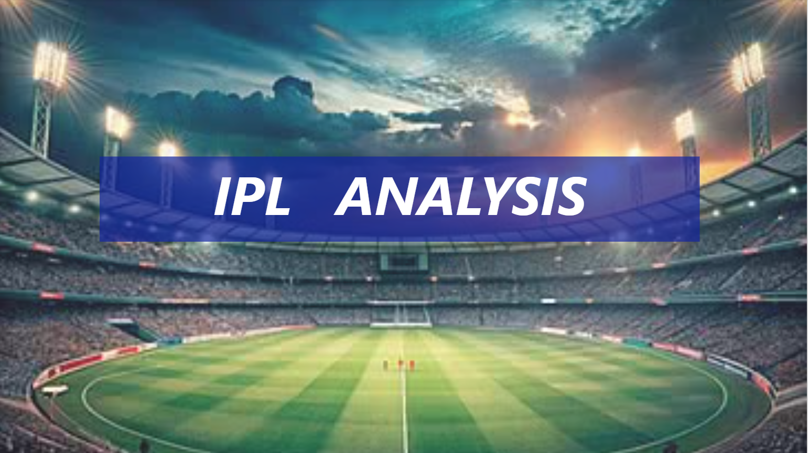
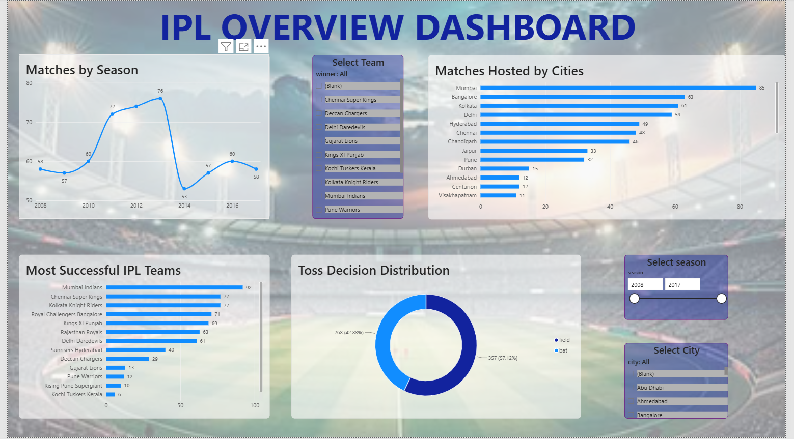
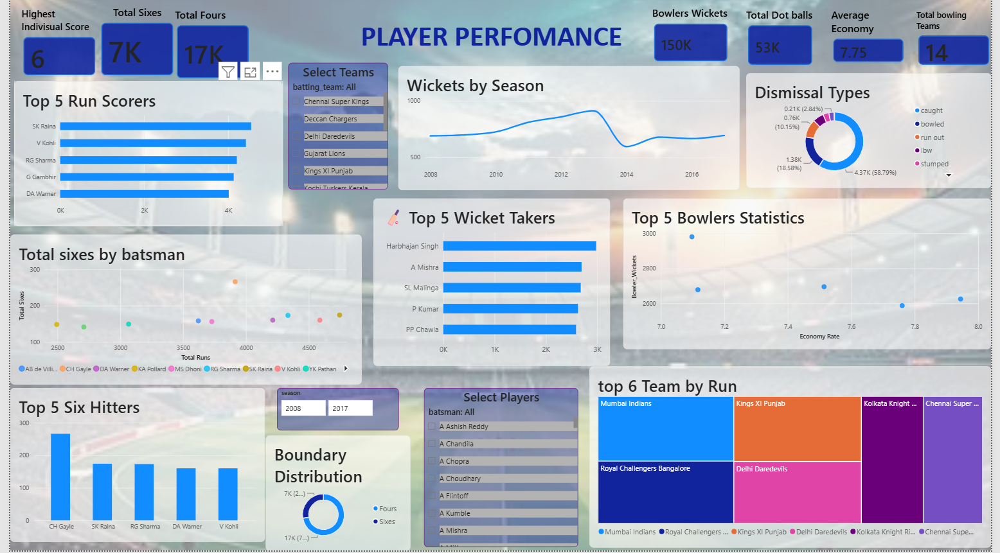
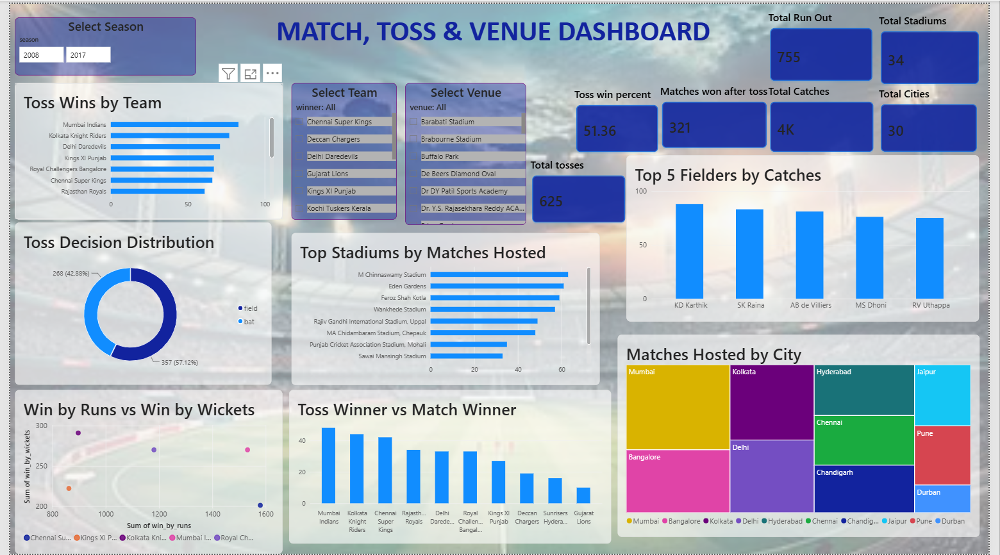
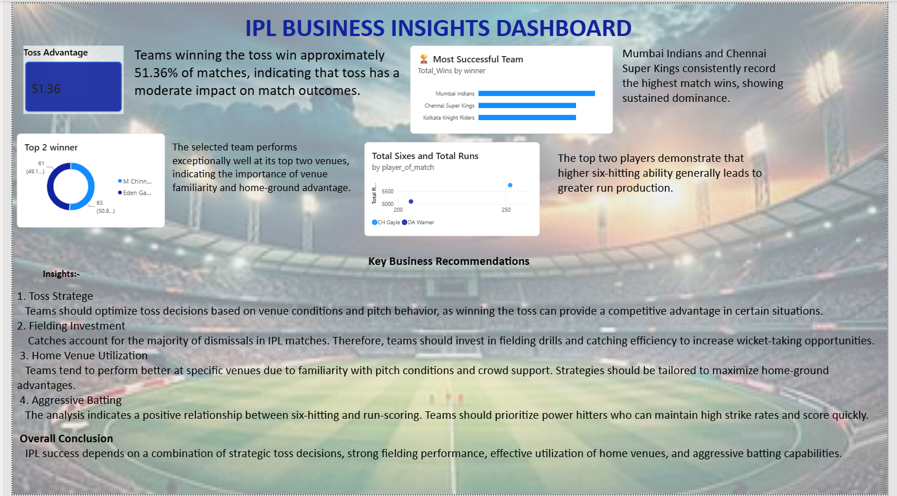

# 🏏 IPL Data Analysis Dashboard using Power BI




---

# 📑 Table of Contents

- Project Overview
- Project Objectives
- Dataset
- Dashboard Pages
- Tools & Technologies
- Key Insights
- Dashboard Preview
- Skills Demonstrated
- Future Enhancements
- Repository Structure
- Author

---

# 📌 Project Overview

The **IPL Data Analysis Dashboard** is an interactive Microsoft Power BI project developed to analyze Indian Premier League (IPL) match and ball-by-ball datasets. The dashboard converts raw cricket data into meaningful visualizations that help users understand player performance, team performance, match outcomes, toss decisions, venue impact, and business insights.

The project demonstrates practical knowledge of **Power BI, Power Query, Data Modeling, DAX, KPI Development, Interactive Dashboards, and Data Storytelling**.

---

# 🎯 Project Objectives

- Analyze IPL matches using interactive dashboards.
- Evaluate player and team performances.
- Understand toss and venue impact on match outcomes.
- Generate business insights from cricket data.
- Practice Power BI dashboard development using real-world datasets.

---

# 📂 Dataset

The datasets used in this project were **provided by my mentor**.

### 📄 Matches Dataset

Contains:

- Match ID
- Season
- Date
- City
- Venue
- Toss Winner
- Toss Decision
- Match Winner
- Player of the Match
- Win by Runs
- Win by Wickets

### 📄 Deliveries Dataset

Contains:

- Match ID
- Innings
- Over
- Ball
- Batter
- Bowler
- Runs
- Extras
- Wickets
- Fielder
- Dismissal Type

---

# 📊 Dashboard Pages

## 🏠 1. Introduction

The Introduction page welcomes users and provides an overview of the project.

### Features

- Project Introduction
- Project Objectives
- Dashboard Navigation

---

## 🏠 2. Home

The Home page provides a quick summary of the project.

### Features

- IPL Logo
- KPI Cards
- Navigation Buttons
- Interactive Slicers

---

## 📈 3. Overview Dashboard

Provides an overall summary of IPL statistics.

### KPI Cards

- Total Matches
- Total Seasons
- Total Teams
- Total Players
- Total Runs
- Total Wickets

### Interactive Filters

- Season
- Team

---

## 🏏 4. Player Performance Dashboard

Analyzes batting and bowling performances.

### Batting Analysis

- Highest Individual Score
- Top Run Scorers
- Runs by Team
- Runs vs Sixes Analysis

### Bowling Analysis

- Total Wickets
- Best Bowler
- Top Wicket Takers
- Economy Rate Analysis
- Dismissal Type Analysis

### Interactive Filters

- Season
- Team
- Player
- Bowler

---

## 🎯 5. Match & Toss Analysis Dashboard

Provides insights into match results, toss decisions, and venue performance.

### Match Analysis

- Toss Winner by Team
- Toss Decision Analysis
- Toss Winner vs Match Winner
- Win by Runs vs Win by Wickets

### Venue Analysis

- Matches by Stadium
- Lucky Stadium
- Top Fielders

### Interactive Filters

- Season
- Team
- Venue

---

## 📊 6. Business Insights Dashboard

Converts analysis into strategic recommendations.

### Business Insights

- Toss Strategy
- Fielding Investment
- Home Ground Advantage
- Aggressive Batting Trends

### Recommendations

- Optimize toss decisions based on venue and pitch conditions.
- Improve fielding performance to increase wicket opportunities.
- Utilize home-ground strengths.
- Prioritize players with strong power-hitting ability.

---

# 🛠️ Tools & Technologies

- Microsoft Power BI
- Power Query
- DAX (Data Analysis Expressions)
- Data Modeling
- Data Visualization
- Interactive Dashboard Design

---

# 📈 Key Insights

- Power hitters contribute significantly to total team runs.
- Catches account for the highest percentage of dismissals.
- Home-ground advantage influences match performance.
- Winning the toss provides an advantage but does not guarantee victory.
- Interactive dashboards simplify IPL performance analysis.

---

# 📷 Dashboard Preview

## 🏠 Introduction



---

## 🏠 Home


---

## 📊 Overview Dashboard



---

## 🏏 Player Performance Dashboard



---

## 🎯 Match & Toss Analysis Dashboard



---

## 📊 Business Insights Dashboard



---

# 💻 Skills Demonstrated

- ✅ Data Cleaning
- ✅ Data Transformation
- ✅ Data Modeling
- ✅ DAX Measures
- ✅ Power Query
- ✅ KPI Development
- ✅ Dashboard Design
- ✅ Interactive Reports
- ✅ Data Visualization
- ✅ Business Intelligence
- ✅ Data Storytelling

---

# 🚀 Future Enhancements

- Integrate live IPL datasets.
- Add player comparison analysis.
- Include predictive analytics.
- Develop mobile-friendly dashboards.
- Add advanced player statistics.

---

# 📂 Repository Structure

```
IPL-Data-Analysis-Dashboard-PowerBI
│
├── IPL_Data_Analysis_Dashboard.pbix
├── README.md
├── 00_Introduction.png
├── 01_Home.png
├── 02_Overview.png
├── 03_Player_Performance.png
├── 04_Match_Toss_Analysis.png
├── 05_Business_Insights.png
```

---

# 👩‍💻 Author

**Dipali More**

🎓 Aspiring Data Analyst

📊 Power BI Enthusiast

🐍 Python Learner

💡 Passionate about Data Analytics, Business Intelligence, Data Visualization, and Building Interactive Dashboards.

---


## ⭐ Support

If you found this project useful or interesting, please consider giving this repository a ⭐.

Thank you for visiting my project!
